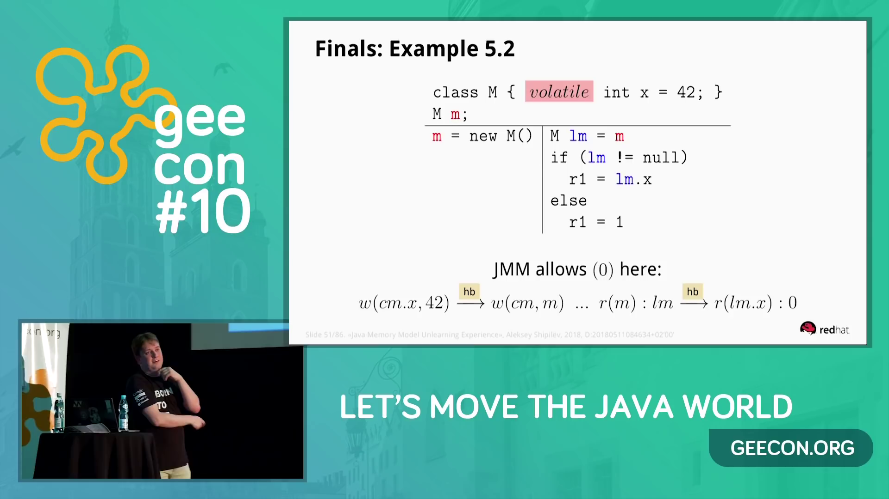

## About

A.Shipilev in [GeeCON 2018: Aleksey Shipilëv - Java Memory Model Unlearning Experience](https://youtu.be/TK-7GCCDF_I?t=2366)
talk (seek to 39:26) gave example of concurrent field initiazation in constructor:



Aleksey states that field `X.m` could have value `0` if reading is performed
from a separate thread.

This repo contains test using [Java Concurrency Stress](https://github.com/openjdk/jcstress) framework.
See `VolatileFieldConstructor.java` for the test source.

## How to run

Build project with Maven

```shell
$> mvn package
```

Run tests with command:

```shell
$> java -XX:+UnlockDiagnosticVMOptions -XX:+StressLCM -XX:+StressGCM -XX:-RestrictContended -jar target/jcstress.jar -t ".*VolatileFieldConstructor.*" -v -f 100
```

Or using shell-script `start-tests.sh`.

## Results

Only outcomes `1` and `42` are met using JDK 11 from https://adoptopenjdk.net
